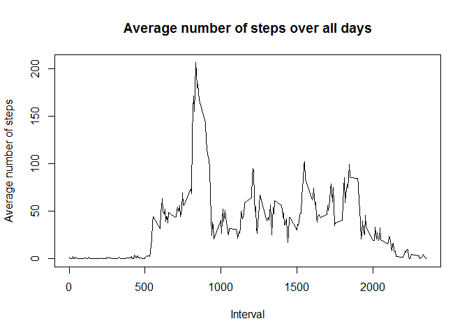

## Loading and preprocessing the data

1.Load the data (i.e. read.csv())


```r
knitr::opts_chunk$set(echo = TRUE)
#Load the Dataset
activity_data <- read.csv("./activity.csv" )

# Creating new dataset by removing NA's for further use
activity_cleandata <- activity_data[ with (activity_data, { !(is.na(steps)) } ), ]
```


## What is mean total number of steps taken per day?

For this part of the assignment,missing values in the dataset are ignored.

1.Calculate the total number of steps taken per day and create a Histogram

2.Calculate and report the mean and median of the total number of steps taken per day


```r
#Calculate sum of steps by date
sumdata<-aggregate(activity_data$steps, by=list(date=activity_data$date),FUN=sum)
sumdata$date <- as.Date(sumdata$date, format="%Y-%m-%d")

#Create a Histogram
hist(sumdata$x, main = "Total Number of steps taken per day", xlab="Steps taken per day")
```

<!-- -->

```r
# Call Summary function on sumdata to derive Mean and Median of total steps
summary(sumdata)
```

```
##       date                  x        
##  Min.   :2012-10-01   Min.   :   41  
##  1st Qu.:2012-10-16   1st Qu.: 8841  
##  Median :2012-10-31   Median :10765  
##  Mean   :2012-10-31   Mean   :10766  
##  3rd Qu.:2012-11-15   3rd Qu.:13294  
##  Max.   :2012-11-30   Max.   :21194  
##                       NA's   :8
```
**Mean of total steps taken per day is 10766 and Median is 10765**


## What is the average daily activity pattern?

1.Make a time series plot (i.e. type = "l") of the 5-minute interval (x-axis) and the average number of steps taken, averaged across all days (y-axis)

2.Which 5-minute interval, on average across all the days in the dataset, contains the maximum number of steps?

```r
# Calculate mean of steps by interval
steps_by_interval <- aggregate(steps ~ interval, activity_data, mean)

# Create the plot
plot(steps_by_interval$interval, steps_by_interval$steps, type='l', 
     main="Average number of steps over all days", xlab="Interval", 
     ylab="Average number of steps")
```

<!-- -->

```r
#Find maximum steps is for which interval
max_steps_row <- which.max(steps_by_interval$steps)
steps_by_interval[max_steps_row, ]
```

```
##     interval    steps
## 104      835 206.1698
```
**Interval `104` has maximum steps of `206.1698113`**


## Imputing missing values

Note that there are a number of days/intervals where there are missing values (coded as NA). The presence of missing days may introduce bias into some calculations or summaries of the data.

1.Calculate and report the total number of missing values in the dataset (i.e. the total number of rows with NAs)

2.Devise a strategy for filling in all of the missing values in the dataset. 

3.Create a new dataset that is equal to the original dataset but with the missing data filled in.

4.Make a histogram of the total number of steps taken each day and Calculate and report the mean and median total number of steps taken per day. check if the values differ from the estimates from the first part of the assignment and what is the impact of imputing missing data on the estimates of the total daily number of steps?


```r
# Summary function is used to find number of rows with NAs
summary(activity_data$steps)
```

```
##    Min. 1st Qu.  Median    Mean 3rd Qu.    Max.    NA's 
##    0.00    0.00    0.00   37.38   12.00  806.00    2304
```
Total number of rows with NAs are `2304`

Strategy is to replace NA's with the mean for 5-minute interval calculated above.


```r
#Create a new dataset
cleandata <- activity_data

#Replace NA's with mean for 5 minute interval
for (i in 1:nrow(cleandata)) {
  if (is.na(cleandata$steps[i])) {
    interval_value <- cleandata$interval[i]
    steps_value <- steps_by_interval[
      steps_by_interval$interval == interval_value,]
    cleandata$steps[i] <- steps_value$steps
  }
}

#Execute the summary again to check if NA rows exist
summary(cleandata$steps)
```

```
##    Min. 1st Qu.  Median    Mean 3rd Qu.    Max. 
##    0.00    0.00    0.00   37.38   27.00  806.00
```

```r
#Calculate sum of data without NA's
sumcleandata<-aggregate(cleandata$steps, by=list(date=cleandata$date),FUN=sum)
sumcleandata$date <- as.Date(sumcleandata$date, format="%Y-%m-%d")

#Create Histogram from data without NA's
hist(sumcleandata$x, main = "Total Number of steps taken per day", xlab="Steps taken per day")
```

<!-- -->

```r
#Execute summary function to derive mean and median on data without NA's
summary(sumcleandata)
```

```
##       date                  x        
##  Min.   :2012-10-01   Min.   :   41  
##  1st Qu.:2012-10-16   1st Qu.: 9819  
##  Median :2012-10-31   Median :10766  
##  Mean   :2012-10-31   Mean   :10766  
##  3rd Qu.:2012-11-15   3rd Qu.:12811  
##  Max.   :2012-11-30   Max.   :21194
```
**There is not much impact of imputing missing data. There is no difference in Mean.  There is some variance in Median**


## Are there differences in activity patterns between weekdays and weekends?
Find differences in activity patterns between weekdays and weekends.

Dataset with the filled-in missing values will be used.

1.Create a new factor variable in the dataset with two levels - "weekday" and "weekend" indicating whether a given date is a weekday or weekend day.


2.Make a panel plot containing a time series plot (i.e. type = "l") of the 5-minute interval (x-axis) and the average number of steps taken, averaged across all weekday days or weekend days (y-axis). 


```r
library(ggplot2)
#Dataset with filled in missing value is used, have added column 'type_of_day' and updated it with name of the day
cleandata['type_of_day'] <- weekdays(as.Date(cleandata$date))

#If 'type of day' is saturday or sunday then update the column 'type_of_day' with text 'weekend', else update it as 'weekday'
cleandata$type_of_day[cleandata$type_of_day  %in% c('Saturday','Sunday') ] <- "weekend"
cleandata$type_of_day[cleandata$type_of_day != "weekend"] <- "weekday"
cleandata$type_of_day <- as.factor(cleandata$type_of_day)

#calculate the mean
cleandatasum <- aggregate(steps ~ interval + type_of_day, cleandata, mean)

#Plot the data
qplot(interval, 
      steps, 
      data = cleandatasum, 
      geom=c("line"),
      xlab = "Interval", 
      ylab = "Number of steps", 
      main = "") +
  facet_wrap(~ type_of_day, ncol = 1)
```

<!-- -->

**We see some difference in weekday and weekend data, the steps are initially less during weekends and then after interval 1000, the steps are bit higher then weekdays**

